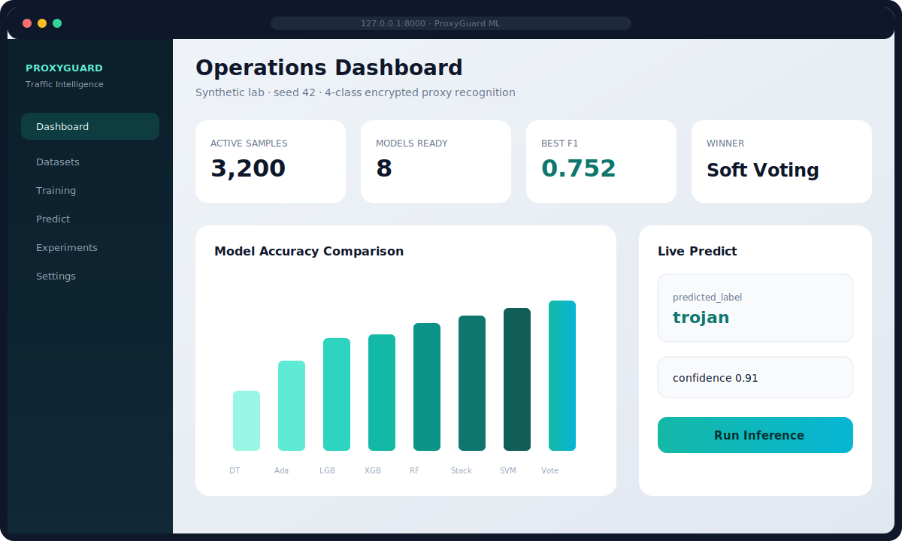
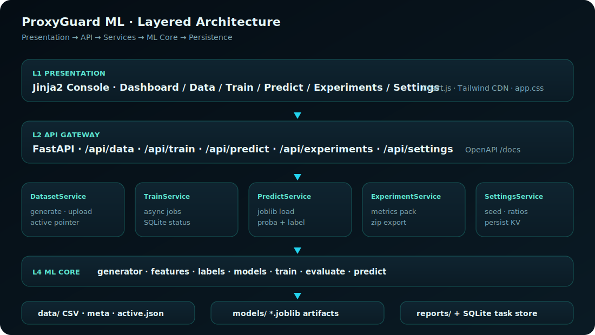
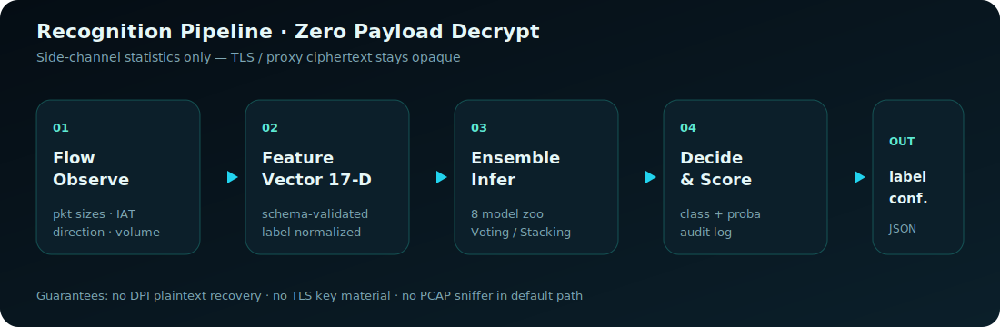
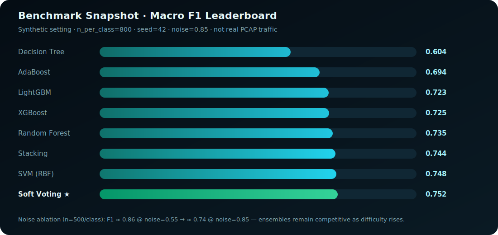
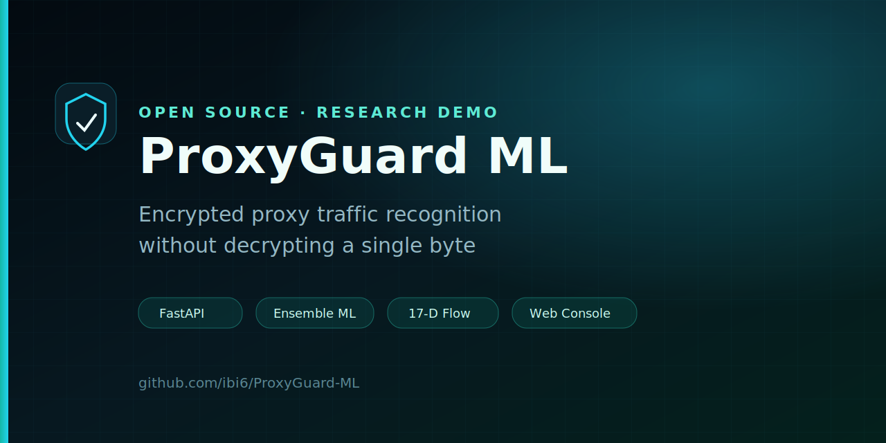

<div align="center">


# ProxyGuard ML · 加密代理流量识别系统

**基于集成学习的加密代理流量识别系统设计与实现**

FastAPI · scikit-learn · XGBoost · LightGBM · Jinja2 · SQLite

[English](README.en.md) · [简体中文](README.md)

<br/>


<br/>


<br/>

[功能特性](#-功能特性) ·
[界面预览](#-界面预览) ·
[系统架构](#-系统架构) ·
[快速开始](#-快速开始) ·
[API](#-api) ·
[实验结果](#-实验结果) ·
[演示流程](#-演示流程)

</div>

<br/>

<div align="center">
  
</div>

---

## ✨ 功能特性

| | 能力 | 说明 |
|:---:|:---|:---|
| 🔒 | **零载荷解密** | 仅流级侧信道统计，不碰 TLS 密钥与明文 |
| 🧠 | **8 模型集成动物园** | DT · SVM · RF · AdaBoost · XGBoost · LightGBM · Soft Voting · Stacking |
| 📊 | **17 维特征 schema** | 包长 · 到达间隔 · 方向 · 规模 · 熵 |
| 🖥️ | **运维控制台** | 总览 · 数据 · 训练 · 识别 · 实验 · 设置 |
| 🔁 | **可复现实验** | 固定种子 `42`、离线脚本、消融实验 |
| 🐳 | **Docker 一键起** | Compose + 数据卷持久化 |
| ✅ | **CI 就绪** | GitHub Actions · pytest · 多版本矩阵 |

**任务定义**

| 项 | 值 |
|----|-----|
| 任务 | 四分类监督学习 |
| 标签 | `normal_https` · `shadowsocks` · `trojan` · `vmess` |
| 运行时 | FastAPI + Jinja2 + SQLite |
| 数据 | 可复现合成生成 **或** 对齐 schema 的 CSV |

> **研究诚实声明。** 默认数据为带**故意类重叠**的合成特征。  
> 仓库**不含**网卡抓包 / PCAP 解析。指标只反映实验室可分性，**不能**等同公网 DPI 准确率。

---

## 🖼️ 界面预览

<div align="center">
  
  <p><sub>控制台示意 · 本地运行后访问 <code>http://127.0.0.1:8000</code></sub></p>
</div>

| 路由 | 工作台 |
|------|--------|
| `/` | 运营总览 Dashboard |
| `/data` | 生成 / 上传 / 预览数据集 |
| `/train` | 多模型训练任务 |
| `/predict` | 在线 17 维推理 |
| `/experiments` | 指标、图表、zip 导出 |
| `/settings` | 随机种子、划分比例等 |

---

## 🏗️ 系统架构

<div align="center">
  
  <br/><br/>
  
</div>

```text
浏览器（Jinja2 + Chart.js）
        │
        ▼
FastAPI  ── /api/data | train | predict | experiments | settings
        │
        ▼
服务层  ── Dataset · Train · Predict · Experiment · Settings
        │
        ▼
ML 核心  ── generator · features · models · train · evaluate · predict
        │
        ▼
存储层  ── data/ · models/*.joblib · reports/ · SQLite
```

---

## 🚀 快速开始

### 环境要求

- Python **3.10+**（推荐 3.11 / 3.12）
- 约 2 GB 可用磁盘
- Windows · macOS · Linux

### 安装与启动

```bash
git clone https://github.com/ibi6/ProxyGuard-ML.git
cd ProxyGuard-ML

python -m venv .venv
# Windows: .\.venv\Scripts\Activate.ps1
# Unix:    source .venv/bin/activate

pip install -U pip
pip install -r requirements.txt

uvicorn app.main:app --host 127.0.0.1 --port 8000 --reload
```

| 地址 | 用途 |
|------|------|
| http://127.0.0.1:8000 | Web 控制台 |
| http://127.0.0.1:8000/api/health | 健康检查 |
| http://127.0.0.1:8000/docs | OpenAPI 文档 |

<details>
<summary><b>Make 常用命令</b></summary>

```bash
make install      # 安装依赖
make test         # 跑 pytest
make run          # 启动 :8000
make experiment   # 离线 n=1000 全模型
make smoke        # 小样本冒烟
make docker-up    # Compose 启动
```

</details>

### Docker

```bash
docker compose up --build
# → http://127.0.0.1:8000
```

---

## 🔌 API

| 方法 | 路径 | 作用 |
|------|------|------|
| `GET` | `/api/health` | 存活检查 |
| `POST` | `/api/data/generate` | 生成合成数据 |
| `POST` | `/api/data/upload` | 上传 CSV |
| `GET` | `/api/data/summary` · `/preview` | 数据摘要 / 预览 |
| `POST` | `/api/train` | 启动训练 |
| `GET` | `/api/train` · `/train/{id}` | 任务列表 / 详情 |
| `GET` | `/api/models` | 模型注册表 |
| `POST` | `/api/predict` | 推理 |
| `GET` | `/api/experiments` | 实验指标 |
| `GET` | `/api/report/export` | 导出 zip |
| `GET`/`PUT` | `/api/settings` | 运行时配置 |

交互文档：`/docs` · ReDoc：`/redoc`

---

## 📈 实验结果

<div align="center">
  
</div>

可控合成设定（`n_per_class=800`，`seed=42`，`noise=0.85`）：

| 名次 | 模型 | Accuracy | Macro F1 |
|:----:|------|---------:|---------:|
| 🥇 | **Soft Voting** | **0.752** | **0.752** |
| 🥈 | SVM (RBF) | 0.750 | 0.748 |
| 🥉 | Stacking | 0.746 | 0.744 |
| 4 | Random Forest | 0.740 | 0.735 |
| 5 | XGBoost | 0.727 | 0.725 |
| 6 | LightGBM | 0.725 | 0.723 |
| 7 | AdaBoost | 0.690 | 0.694 |
| 8 | Decision Tree | 0.600 | 0.604 |

**噪声消融**（每类 500）：最优 F1 约 **0.86**（`noise=0.55`）→ 约 **0.74**（`noise=0.85`）。

### 模型动物园

| 键名 | 角色 |
|------|------|
| `decision_tree` | 可解释基线 |
| `svm` | RBF SVM（标准化） |
| `random_forest` | Bagging |
| `adaboost` | Boosting |
| `xgboost` / `lightgbm` | 梯度提升 |
| `voting` | 软投票集成 |
| `stacking` | 堆叠元学习器 |

### 17 维特征

| 分组 | 列名 |
|------|------|
| 包长 | `pkt_len_mean` `pkt_len_std` `pkt_len_min` `pkt_len_max` `pkt_len_p25` `pkt_len_p75` |
| 到达间隔 | `iat_mean` `iat_std` `iat_burstiness` |
| 方向 | `uplink_pkt_ratio` `byte_up_down_ratio` |
| 流规模 | `duration` `total_packets` `total_bytes` `packets_per_second` |
| 复杂度 | `pkt_size_entropy` `iat_entropy` |

---

## 🎬 演示流程

**五分钟闭环**

1. **数据** → 每类生成约 1000 条  
2. **训练** → 勾选 `random_forest`、`xgboost`、`voting`（或全部 8 个）  
3. **识别** → 使用默认 17 维样例推理  
4. **实验** → 对比 F1 / 导出 zip  

**无界面离线**

```bash
python scripts/run_experiments.py --n-per-class 1000 --seed 42
python scripts/run_experiments.py --n-per-class 200 --seed 42 --models decision_tree,random_forest
```

**测试**

```bash
pytest -q
# 或: make test
```

---

## 📁 仓库结构

```text
ProxyGuard-ML/
├── app/                 # FastAPI · 服务 · ML 核心 · 界面
├── tests/               # API + ML 测试
├── scripts/             # 离线实验与消融
├── docs/                # 设计与实验文档
├── assets/              # Logo、架构图、社交卡片
├── data/ models/ reports/
├── Dockerfile · docker-compose.yml
└── pyproject.toml · Makefile · CITATION.cff
```

---

## ⚠️ 已知限制

| 约束 | 含义 |
|------|------|
| 默认同数据 | **不是**真实 Shadowsocks / Trojan / VMess 抓包 |
| 无 PCAP 管线 | 需自备特征或扩展提取器 |
| 无登录鉴权 | 演示请绑定 `127.0.0.1` |
| 线程内训练 | 全模型重训可能拖慢 Web 进程 |

---

## 🗺️ 路线图

- [ ] PCAP → 流聚合 → 对齐 `FEATURE_COLUMNS`  
- [ ] 更多协议（OpenVPN、WireGuard 等）  
- [ ] 嵌套交叉验证 + 结构化超参搜索  
- [ ] 类别不平衡与 合成→真实 域偏移  
- [ ] 可选流式 / 镜像旁路检测  
- [ ] 加固的多用户部署模式  

---

## 📚 文档

| 资源 | 链接 |
|------|------|
| 🇬🇧 English README | [README.en.md](README.en.md) |
| 文档中枢 | [docs/README.zh-CN.md](docs/README.zh-CN.md) |
| 系统设计 | [docs/system-design.md](docs/system-design.md) |
| 实验指南 | [docs/experiment-guide.md](docs/experiment-guide.md) |
| 贡献指南 | [CONTRIBUTING.md](CONTRIBUTING.md) |
| 安全策略 | [SECURITY.md](SECURITY.md) |
| 变更日志 | [CHANGELOG.md](CHANGELOG.md) |
| 引用 | [CITATION.cff](CITATION.cff) |

---

## 📄 许可证与伦理

**MIT** — 见 [LICENSE](LICENSE)。

用于**教学、研究与防御性演示**。  
**请勿**用于未授权监控。发表指标时请标明数据来源（合成 / 真实）。

---

<div align="center">



<br/>

如果这个项目对你有帮助，欢迎 **[⭐ Star](https://github.com/ibi6/ProxyGuard-ML)**。

<sub>FastAPI · scikit-learn · XGBoost · LightGBM · 集成学习</sub><br/>
<a href="https://github.com/ibi6/ProxyGuard-ML"><b>github.com/ibi6/ProxyGuard-ML</b></a>

</div>
