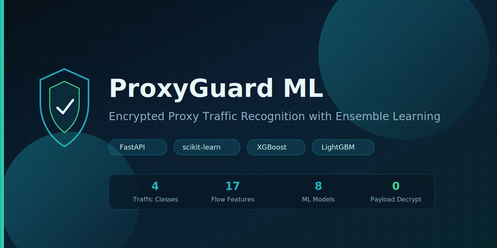

<p align="center">
  
</p>

<p align="center">
  <strong>Side-channel ensemble learning for encrypted proxy traffic recognition</strong><br/>
  FastAPI console · 17-D flow features · 8 models · reproducible demos
</p>

<p align="center">
  <a href="https://github.com/ibi6/ProxyGuard-ML/actions/workflows/ci.yml"></a>
  <a href="https://www.python.org/downloads/"></a>
  <a href="https://fastapi.tiangolo.com/"></a>
  <a href="LICENSE"></a>
  
  
</p>

<p align="center">
  <a href="#-quick-start">Quick Start</a> ·
  <a href="#-features">Features</a> ·
  <a href="#-architecture">Architecture</a> ·
  <a href="#-model-zoo">Model Zoo</a> ·
  <a href="#-api">API</a> ·
  <a href="#-docker">Docker</a> ·
  <a href="docs/system-design.md">Design Docs</a>
</p>

---

## Why ProxyGuard ML?

Modern proxies ride on TLS-like tunnels. **You cannot (and should not) decrypt payloads** for casual classification. ProxyGuard ML instead treats each flow as a statistical fingerprint:

```text
encrypted bytes  ──►  17 flow-level stats  ──►  ensemble classifiers  ──►  label + confidence
                         (no DPI decrypt)
```

| | |
|---|---|
| **Task** | 4-class supervised learning |
| **Labels** | `normal_https` · `shadowsocks` · `trojan` · `vmess` |
| **Features** | 17 fixed flow-level statistics |
| **Models** | DT · SVM · RF · AdaBoost · XGBoost · LightGBM · Soft Voting · Stacking |
| **UI** | FastAPI + Jinja2 ops console |
| **Data** | Reproducible synthetic features **or** schema-aligned CSV upload |

> **Honesty first.** Default data is **synthetic** (class-conditional Gaussians with intentional overlap). There is **no live capture / PCAP parser** in this repo. Metrics reflect separability under that controlled setting — not production DPI accuracy on the open internet.

---

## Features

| Capability | Detail |
|------------|--------|
| **End-to-end console** | Dashboard → Data → Train → Predict → Experiments → Settings |
| **Reproducible data** | Seeded generator (`seed=42` by default), controllable noise |
| **CSV import** | Must include `label` + all 17 feature columns |
| **Ensemble focus** | Soft Voting & Stacking vs strong single learners |
| **Paper-ready plots** | Accuracy / F1 bars, confusion matrices, feature importance |
| **Background training** | Threaded jobs with SQLite task status |
| **Offline runners** | `scripts/run_experiments.py`, `scripts/run_ablation.py` |
| **CI** | GitHub Actions: multi-version pytest + compile check |

---

## Architecture

```text
┌────────────────────────────────────────────────────────────┐
│  Browser  ·  Jinja2 console  ·  static CSS/JS              │
└───────────────────────────┬────────────────────────────────┘
                            │ HTTP
┌───────────────────────────▼────────────────────────────────┐
│  FastAPI  ·  page routes + /api/*                          │
└───────────────────────────┬────────────────────────────────┘
                            │
        ┌───────────────────┼───────────────────┐
        ▼                   ▼                   ▼
   DatasetService      TrainService       PredictService
   ExperimentService   SettingsService
        │                   │                   │
        └───────────────────┼───────────────────┘
                            ▼
              ML core  ·  generator / features / models
                         train / evaluate / predict
                            │
        ┌───────────────────┼───────────────────┐
        ▼                   ▼                   ▼
     data/              models/              reports/
     SQLite             *.joblib             metrics + figures
```

Layering is intentional: **API adapters → services → ML core → storage**.

---

## Quick Start

### Requirements

- Python **3.10+** (3.11 / 3.12 recommended)
- ~2 GB free disk for deps + models
- Windows / macOS / Linux

### 1) Install

```bash
git clone https://github.com/ibi6/ProxyGuard-ML.git
cd ProxyGuard-ML

python -m venv .venv

# Windows PowerShell
.\.venv\Scripts\Activate.ps1

# macOS / Linux
source .venv/bin/activate

pip install -U pip
pip install -r requirements.txt
```

### 2) Run the console

```bash
uvicorn app.main:app --host 127.0.0.1 --port 8000 --reload
```

| URL | Purpose |
|-----|---------|
| http://127.0.0.1:8000 | Web console |
| http://127.0.0.1:8000/api/health | Health check |

| Path | Page |
|------|------|
| `/` | Dashboard |
| `/data` | Dataset management |
| `/train` | Model training |
| `/predict` | Online recognition |
| `/experiments` | Metrics & charts |
| `/settings` | Runtime settings |

### 3) Five-minute demo loop

1. **Data** → generate synthetic samples (e.g. `1000` per class)  
2. **Train** → select models (include `random_forest`, `xgboost`, `voting`)  
3. **Predict** → paste the sample 17-D JSON or use defaults  
4. **Experiments** → compare Accuracy / F1, export zip report  

### Offline experiment (no UI)

```bash
python scripts/run_experiments.py --n-per-class 1000 --seed 42

# smoke
python scripts/run_experiments.py --n-per-class 200 --seed 42 --models decision_tree,random_forest
```

---

## Docker

```bash
docker compose up --build
# open http://127.0.0.1:8000
```

Volumes mount `data/`, `models/`, and `reports/` so training artifacts survive restarts.

```bash
# plain Docker
docker build -t proxyguard-ml .
docker run --rm -p 8000:8000 \
  -v "%cd%/data:/app/data" \
  -v "%cd%/models:/app/models" \
  -v "%cd%/reports:/app/reports" \
  proxyguard-ml
```

---

## Model Zoo

| Key | Role |
|-----|------|
| `decision_tree` | Interpretable baseline |
| `svm` | RBF SVM (scaled pipeline) |
| `random_forest` | Bagging ensemble |
| `adaboost` | Boosting ensemble |
| `xgboost` | Gradient boosting |
| `lightgbm` | Gradient boosting |
| `voting` | Soft voting over strong bases |
| `stacking` | Stacking + logistic meta-learner |

Default split: **70% / 15% / 15%** train / val / test · seed **42**.  
Metrics: Accuracy · Precision / Recall / F1 (**macro**).

### Feature schema (17-D)

| Group | Columns |
|-------|---------|
| Packet length | `pkt_len_mean`, `pkt_len_std`, `pkt_len_min`, `pkt_len_max`, `pkt_len_p25`, `pkt_len_p75` |
| Inter-arrival | `iat_mean`, `iat_std`, `iat_burstiness` |
| Direction | `uplink_pkt_ratio`, `byte_up_down_ratio` |
| Flow scale | `duration`, `total_packets`, `total_bytes`, `packets_per_second` |
| Complexity | `pkt_size_entropy`, `iat_entropy` |

---

## API

| Method | Path | Description |
|--------|------|-------------|
| `GET` | `/api/health` | Liveness |
| `POST` | `/api/data/generate` | Generate synthetic dataset |
| `POST` | `/api/data/upload` | Upload CSV |
| `GET` | `/api/data/summary` | Active dataset summary |
| `GET` | `/api/data/preview` | Row preview |
| `POST` | `/api/train` | Start training job |
| `GET` | `/api/train` | List jobs |
| `GET` | `/api/train/{task_id}` | Job detail |
| `GET` | `/api/models` | Model zoo |
| `POST` | `/api/predict` | Infer label + confidence |
| `GET` | `/api/experiments` | Metrics payload |
| `GET` | `/api/report/export` | Export zip |
| `GET` / `PUT` | `/api/settings` | Settings |

Interactive docs (when server is running): http://127.0.0.1:8000/docs

---

## Repository layout

```text
ProxyGuard-ML/
├── app/                 # FastAPI app, services, ML core, templates
├── tests/               # pytest suite
├── scripts/             # offline experiment & ablation runners
├── docs/                # system design + experiment guide
├── data/                # datasets (generated locally)
├── models/              # joblib artifacts (generated locally)
├── reports/             # metrics & figures (generated locally)
├── assets/              # README visuals
├── Dockerfile
├── docker-compose.yml
└── requirements.txt
```

---

## Testing & CI

```bash
pytest -q
```

GitHub Actions runs on every push / PR to `main`:

- Python **3.11** and **3.12** test matrix  
- Package compile check  

---

## Limitations

- Synthetic-by-default data — not real Shadowsocks / Trojan / VMess captures  
- No NIC sniffer, no PCAP pipeline, no TLS decryption  
- No authentication — bind to localhost for demos  
- Tiny samples can overfit; prefer ≥1000 samples per class for reporting  

---

## Roadmap

- [ ] Real PCAP → flow aggregation → `FEATURE_COLUMNS` pipeline  
- [ ] More protocols (OpenVPN, WireGuard, …)  
- [ ] Cross-validation & systematic hyperparameter search  
- [ ] Class imbalance / domain shift (synthetic → real)  
- [ ] Optional streaming detection path  
- [ ] Hardened multi-user deployment mode  

---

## Documentation

| Doc | Contents |
|-----|----------|
| [docs/system-design.md](docs/system-design.md) | Requirements, architecture, modules, flows |
| [docs/experiment-guide.md](docs/experiment-guide.md) | Dataset, features, models, metrics, steps |
| [CONTRIBUTING.md](CONTRIBUTING.md) | Dev setup & PR rules |
| [SECURITY.md](SECURITY.md) | Vulnerability reporting |

---

## License & ethics

Released under the [MIT License](LICENSE).

This software is for **education, research, and defensive analysis demos**.  
Do **not** use it for unauthorized monitoring. When publishing results, **state the data source** (synthetic vs real) clearly.

---

<p align="center">
  <sub>Built with FastAPI · scikit-learn · XGBoost · LightGBM</sub><br/>
  <a href="https://github.com/ibi6/ProxyGuard-ML">github.com/ibi6/ProxyGuard-ML</a>
</p>
